# 业务系统部署指南

**步骤说明：**

1. 部署合约（如果还不会部署合约，请阅读这篇 [solidity小白入门](https://github.com/GuaiPotato/Solidity-Development-Guide/blob/master/solidity%E5%B0%8F%E7%99%BD%E5%85%A5%E9%97%A8.md) 中的 **编译部署合约** 部分）
2. 补全前后端代码
3. 修改配置
4. 下载依赖
5. 启动


**环境准备：**

1. webase平台

   > 注意：如果已经部署过合约，需要重新部署节点，防止合约出现问题。

2. 软件环境：[nvm](https://github.com/coreybutler/nvm-windows/releases)，[git](https://git-scm.com/download/win)， [go(1.20+)](https://go.dev/doc/install)，mysql，redis

3. 数据库管理软件：Navicat、SQLyog等

4. 开发工具：vscode


## 软件环境及开发工具配置

### nvm

安装完成后打开 **cmd** / **powershell**

安装node.js 16

```shell
nvm install 16
```

使用node.js 16

```
nvm use 16
```

检验node.js是否正常

```shell
npm version
```

有版本号输出说明正常

### vscode

点击左侧扩展，下载插件

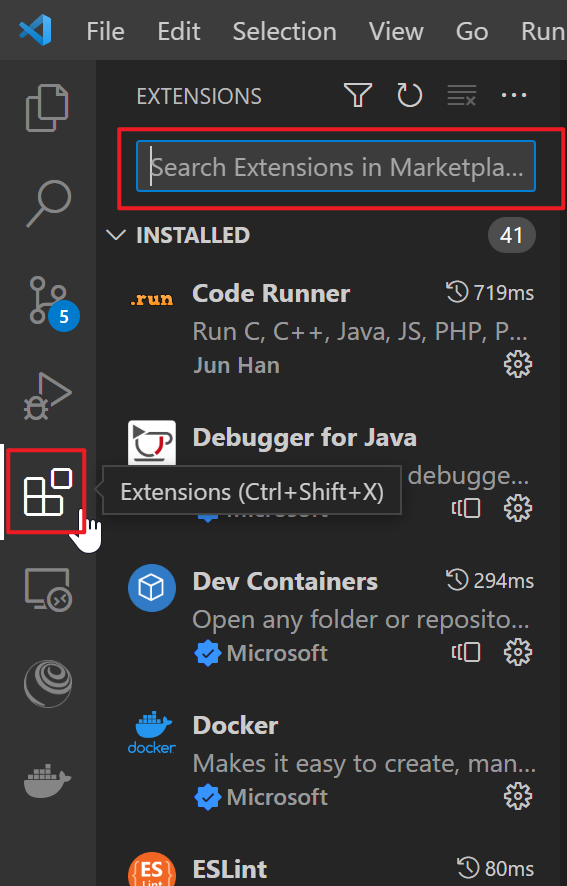

需要下载的插件如下：

- **Chinese (Simplified) (简体中文) Language Pack for Visual Studio Code**
- **Go**
- **Vue Language Features (Volar)**
- **Solidity**（两个，灰色和黄色）
- **Prettier - Code formatter**

## 补全代码

按照答案补全代码或直接使用完整代码

## 修改配置并启动

> 注意：下面所有配置的具体参数以实际情况为准！

### 后端（API方式）

#### 修改配置

修改 `app.conf`

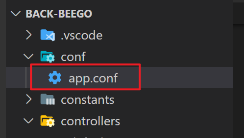

修改 **部署用户地址**， **合约地址**

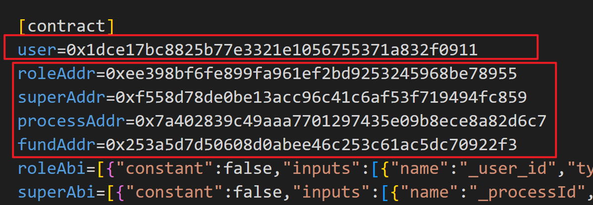

> 复制webase平台中相应信息即可，如果看不懂什么是用户地址或合约地址，请回到第一步阅读文档

修改 **webase** 连接配置

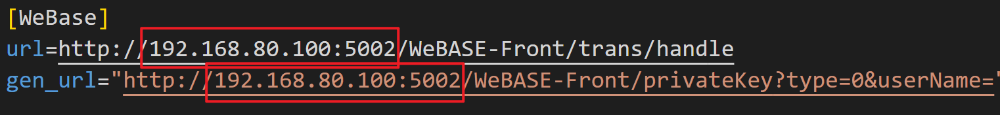

修改 **数据库** 配置

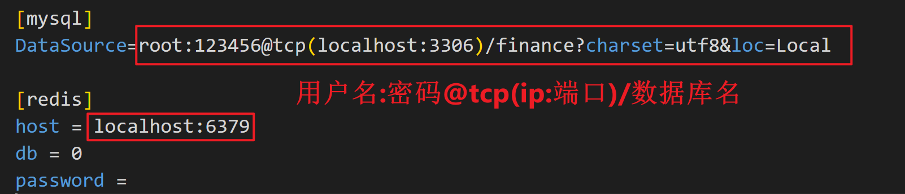

#### 下载依赖并启动

在vscode中使用快捷键 `ctrl` + `

换源（先尝试使用官方源，看看下载是否可以正常进行，不行再换源）

```shell
go env -w  GOPROXY=https://goproxy.cn,direct
```

下载依赖

```shell
go mod tidy
```

启动

```shell
bee run
```

启动成功终端输入如下：

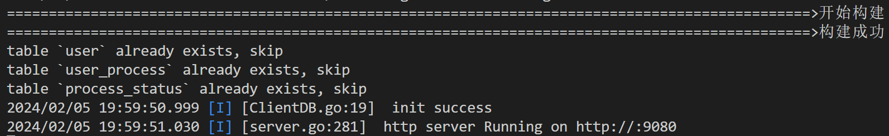


### 前端

#### 修改配置

##### 修改 `request.js` 文件中的基本请求

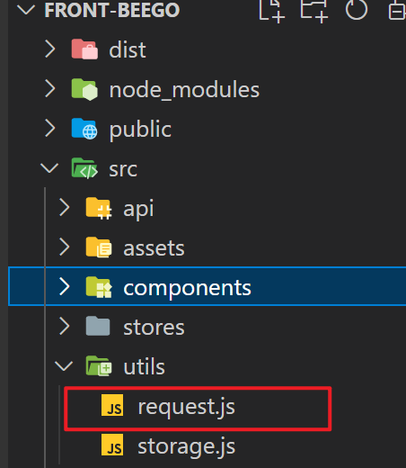

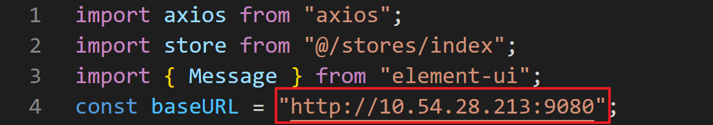

修改为后端IP+端口号

> 端口号后端启动的终端输出里有，默认为9080

##### 修改 `vue-config.js` 中后端请求位置和 fisco bcos 请求位置

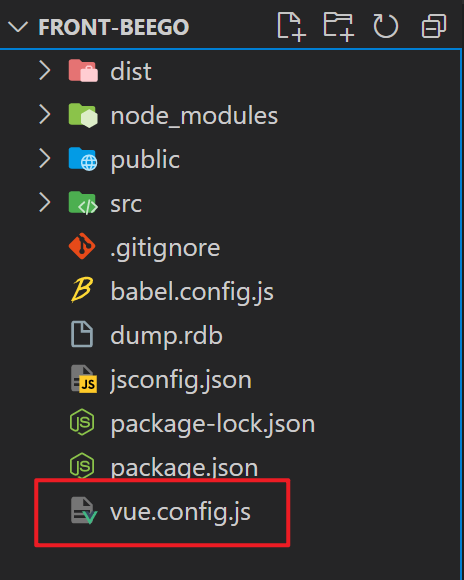

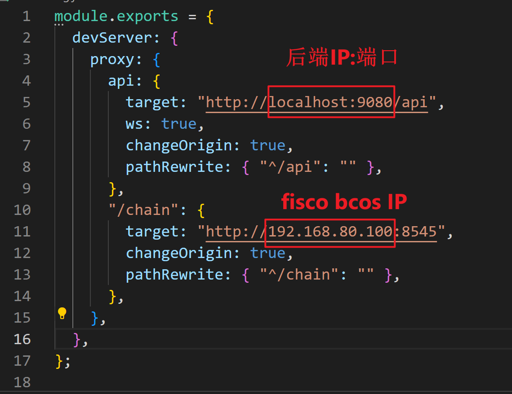

#### 下载依赖

vscode快捷键 `ctrl` + `

换源（先尝试使用官方源，看看下载是否可以正常进行，不行再换源）

```shell
npm config set registry https://mirrors.huaweicloud.com/repository/npm/
```

下载依赖

```shell
npm i
```

启动

```shell
npm run serve
```

正常启动终端输出如下

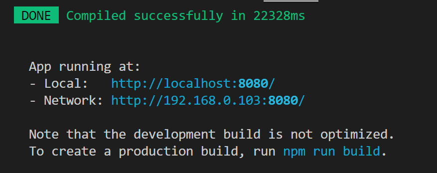

按住 `ctrl` 点击 **Local** 后的网址，打开网站，查看是否正常显示。

